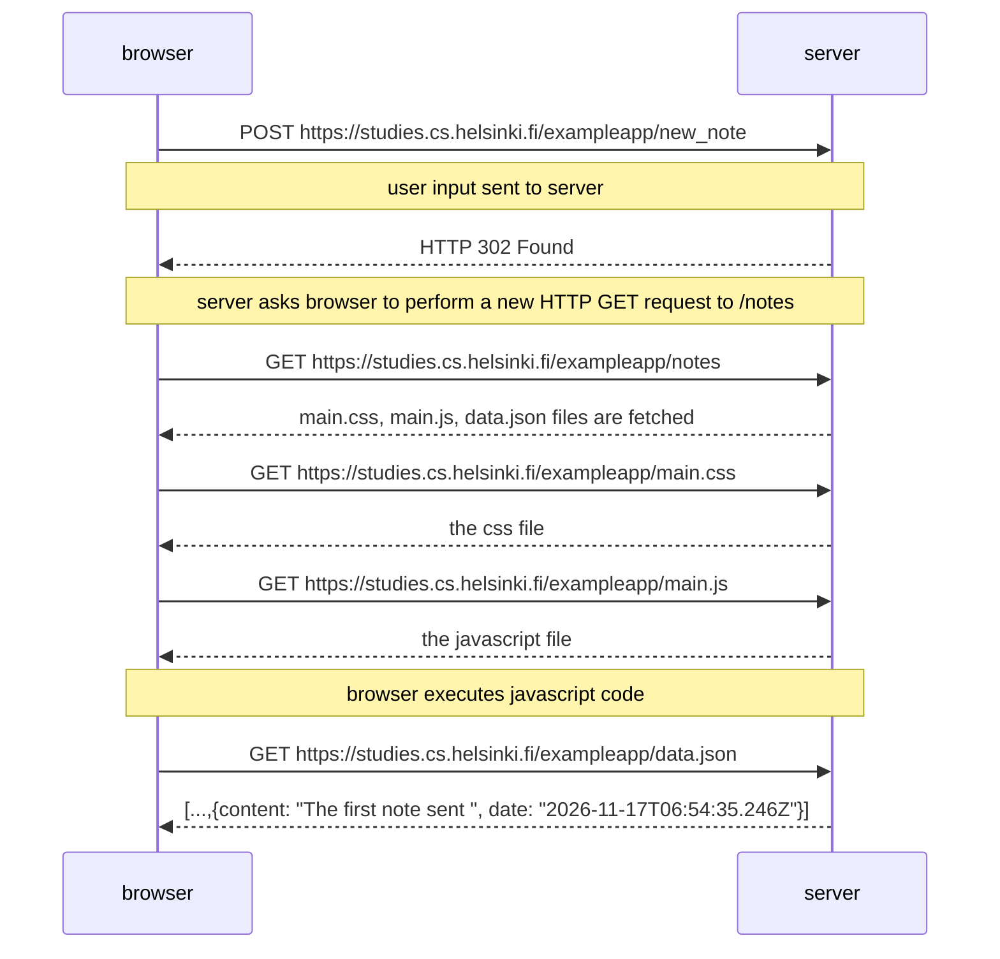

```mermaid
sequenceDiagram
    participant browser
    participant server

    browser->>server: POST https://studies.cs.helsinki.fi/exampleapp/new_note
    Note over browser,server: user input sent to server
    server-->>browser: HTTP 302 Found
    Note over browser,server: server asks browser to perform a new HTTP GET request to /notes

    browser->>server: GET https://studies.cs.helsinki.fi/exampleapp/notes
    server-->>browser: main.css, main.js, data.json files are fetched

    browser->>server: GET https://studies.cs.helsinki.fi/exampleapp/main.css
    server-->>browser: the css file

    browser->>server: GET https://studies.cs.helsinki.fi/exampleapp/main.js
    server-->>browser: the javascript file
    Note over browser,server: browser executes javascript code

    browser->>server: GET https://studies.cs.helsinki.fi/exampleapp/data.json
    server-->>browser: [...,{content: "The first note sent ", date: "2026-11-17T06:54:35.246Z"}]

```