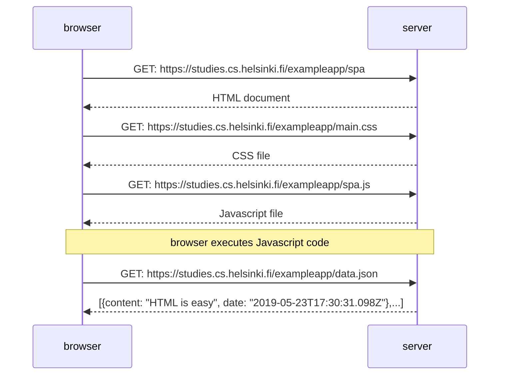

```mermaid
sequenceDiagram
    participant browser
    participant server

    browser->>server: GET: https://studies.cs.helsinki.fi/exampleapp/spa
    server-->>browser: HTML document

    browser->>server: GET: https://studies.cs.helsinki.fi/exampleapp/main.css
    server-->>browser: CSS file

    browser->>server: GET: https://studies.cs.helsinki.fi/exampleapp/spa.js
    server-->>browser: Javascript file
    Note over browser,server: browser executes Javascript code

    browser->>server: GET: https://studies.cs.helsinki.fi/exampleapp/data.json

    server-->>browser: [{content: "HTML is easy", date: "2019-05-23T17:30:31.098Z"},...]

```    